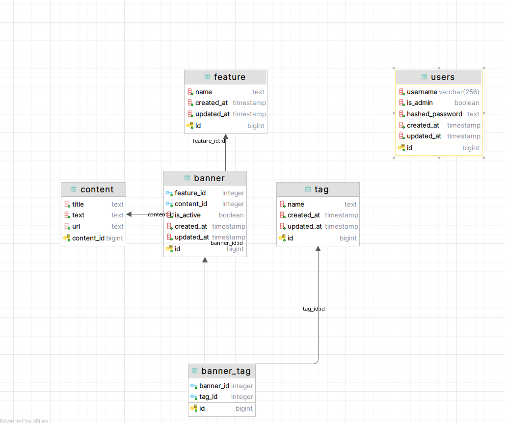

## Avito backend trainee 2024 assignment

По поводу структуры базы данных: в задании написано,  
что banner - объект неопределенной структуры, отсюда неясно, что этот объект по своей природе неопределенной структуры
(она способна изменяться) или выполняющему необходимо самому придумать эту структуру. Я принял второй вариант.

### Структура БД следующая:

 

в задании написано:
- Один баннер может быть связан только с одной фичей и несколькими тегами
- При этом один тег, как и одна фича, могут принадлежать разным баннерам одновременно
- Фича и тег однозначно определяют баннер

В этих пунктах есть противоречие с тем, что баннер может быть связан с несколькими тегами, 
но, при этом, фича и тег однозначно определяют баннер.  
**Интерпретирую это так: _фича и набор тегов однозначно определяют баннер_.**

### TODO: ПРОВЕСТИ НАГРУЗОЧНЫЙ ТЕСТ!!

### Основные требования: 
- [x] Используйте этот [API](https://drive.google.com/file/d/1l4PMTPzsjksRCd_lIm0mVfh4U0Jn-A2R/view?usp=share_link)
- [ ] Тегов и фичей небольшое количество (до 1000), RPS — 1k, SLI времени ответа — 50 мс, SLI успешности ответа — 99.99%
- [x] Для авторизации доступов должны использоваться 2 вида токенов: пользовательский и админский. Получение баннера может происходить с помощью пользовательского или админского токена, а все остальные действия могут выполняться только с помощью админского токена.  
- [x] Реализуйте интеграционный или E2E-тест на сценарий получения баннера.
- [x] Если при получении баннера передан флаг use_last_revision, необходимо отдавать самую актуальную информацию. В ином случае допускается передача информации, которая была актуальна 5 минут назад.
- [x] Баннеры могут быть временно выключены. Если баннер выключен, то обычные пользователи не должны его получать, при этом админы должны иметь к нему доступ.

### Дополнительные требования:
